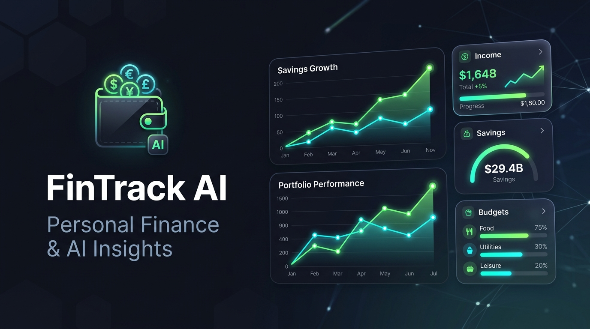

# FinTrack AI — Smart Personal Finance & AI Insights

[](https://fintrack-ai.pages.dev)
[](https://supabase.com)
[](https://developer.mozilla.org)
[](LICENSE)



**FinTrack AI** is an intelligent, privacy-first personal finance tracking dashboard. It empowers users to monitor net worth, categorize transactions, set category budgets, track savings goals, manage recurring bills, and receive actionable financial insights powered by Cloudflare Workers AI.

🚀 **Live Demo:** [https://fintrack-ai.pages.dev](https://fintrack-ai.pages.dev)

---

## ✨ Key Features

- 📊 **Real-time Financial Overview**: Instant metrics for Net Worth, Monthly Income, Monthly Spending, and Savings Rate.
- 💳 **Transaction Tracking**: Log and filter income & expenses with detailed category allocations and clean visualizations.
- 🎯 **Visual Budgeting**: Set monthly spending targets per category with dynamic progress meters and budget health indicators.
- 🏆 **Savings Goals**: Track milestones for emergency funds, vacations, and investments with interactive progress bars.
- 🔔 **Bills & Subscriptions**: Monitor due dates, upcoming payments, and mark bills as paid or overdue.
- 🤖 **AI Spending Insights**: Instant AI analysis of spending patterns and actionable recommendations powered by free Cloudflare Workers AI (`llama-3.1-8b-instruct`).
- 🧾 **AI Receipt Scanner**: Snap or upload receipt images for instant OCR and transaction data extraction (`llama-3.2-11b-vision-instruct`).
- 📄 **One-Click PDF Export**: Client-side financial statement generation formatted with totals, income vs. expense breakdowns, and active budgets.
- 🔐 **Authentication & Security**: Protected routes, Supabase Google OAuth, email authentication, and guest demo mode.

---

## 🛠️ Architecture & Tech Stack

| Layer | Technology |
| :--- | :--- |
| **Frontend** | Pure Vanilla HTML5, CSS3, Modern ES6+ JavaScript |
| **Icons & Design** | Lucide Icons, responsive modern dark-mode aesthetic |
| **Authentication & Database** | Supabase (PostgreSQL, Row Level Security, Google OAuth) |
| **Edge AI & Hosting** | Cloudflare Pages + Workers AI (Llama 3.1 & Vision 3.2) |
| **PDF Generation** | PDF-Lib client-side synthesis |

---

## 🚀 Getting Started

### 1. Clone the Repository
```bash
git clone https://github.com/shivenmhatre23-cell/FinTrack-AI.git
cd FinTrack-AI
```

### 2. Run Locally
Because FinTrack AI is built with pure Vanilla web technologies, you don't need any build steps or compilers!

Simply open `index.html` in your favorite browser:
```bash
# Windows
start index.html

# macOS
open index.html

# Linux
xdg-open index.html
```

Or serve with any static server:
```bash
npx serve .
```

### 3. Deploy to Cloudflare Pages
```bash
npx wrangler pages deploy . --project-name fintrack-ai
```

---

## 🔒 Environment Configuration

To configure your own Supabase project:
1. Create a Supabase project at [supabase.com](https://supabase.com).
2. Execute the migrations provided in the `supabase/migrations/` directory.
3. Configure your Site URL and Redirect URLs in Supabase Authentication settings:
   - **Site URL**: `https://your-domain.pages.dev`
   - **Redirect URLs**: `https://your-domain.pages.dev/**`

---

## 👤 Author

**Shiven Mhatre**
- GitHub: [@shivenmhatre23-cell](https://github.com/shivenmhatre23-cell)
- Project Repository: [FinTrack-AI](https://github.com/shivenmhatre23-cell/FinTrack-AI)
